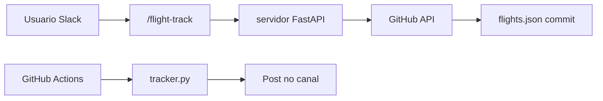

# Flight Price Tracker

Rastreia precos no Google Flights e envia um resumo diario no Slack (**canal**, **conversa em grupo** ou **DM**).

**Guia completo (GitHub push, PAT, Railway ou Render, slash `/flight-track`):** [docs/DEPLOY.md](docs/DEPLOY.md)

**Workflow GitHub Actions:** copie [docs/flight-track-daily.yml](docs/flight-track-daily.yml) para `.github/workflows/flight-track-daily.yml` se ainda não existir no repo (tokens MCP/API muitas vezes não conseguem criar ficheiros em `.github/workflows/`).

## Requisitos

- macOS (para `launchd`)
- Python 3.10+
- Conta Slack e um [Slack App](https://api.slack.com/apps) com:
  - **Bot Token Scopes:** `chat:write` (obrigatorio)
  - **DM so com o bot:** tambem `im:write`
  - Instalar o app no workspace e copiar o **Bot User OAuth Token** (`xoxb-...`)

### Canal ou grupo (duas pessoas + bot, etc.)

1. Crie o canal **ou** abra a conversa em grupo e **adicione o app** (`/invite @NomeDoApp` ou pelo menu da conversa).
2. Obtenha o **ID da conversa** (comeca com `C` ou `G`): menu do canal → *Integrations* / *About* / link da conversa (o ID aparece na URL `.../archives/C...` ou `.../archives/G...`).
3. No `.env`, defina `SLACK_CHANNEL_ID` com esse ID.

### Sempre na mesma thread

1. No Slack, na conversa desejada, clique com o botao direito na **mensagem pai** da thread → *Copy link* (ou copie o `thread_ts` via API).
2. O timestamp no link costuma ser algo como `p1730000000123456` → converta para `1730000000.123456` (ponto antes dos ultimos 6 digitos) **ou** use *Copy message link* e extraia da URL.
3. Preencha `SLACK_CHANNEL_ID` **e** `SLACK_THREAD_TS` no `.env`. Cada execucao do tracker posta **dentro dessa thread**.

### Só DM (1 pessoa)

Deixe `SLACK_CHANNEL_ID` vazio e use `SLACK_USER_ID` (seu member ID `U...`).

## URLs dos voos

As URLs do Google Flights precisam estar **completas** (copie da barra de endereco do navegador). Links colados em chats costumam vir **truncados** (`[...]`): eles nao funcionam ate voce colar o endereco inteiro. Edite [`flights.json`](flights.json) e preencha o campo `url` de cada voo (nao deixe vazio).

## Setup rapido

```bash
cd /caminho/para/flight-track
cp .env.example .env
# Edite .env: SLACK_BOT_TOKEN + (SLACK_CHANNEL_ID ou SLACK_USER_ID); opcional SLACK_THREAD_TS

chmod +x install.sh
./install.sh
```

O script cria `.venv`, instala dependencias, instala o Chromium do Playwright e registra o LaunchAgent para rodar todo dia as 9h.

## Rodar manualmente

```bash
source .venv/bin/activate
python tracker.py
```

Para testar scraping e mensagem **sem** enviar ao Slack:

```bash
SKIP_SLACK=1 python tracker.py
```

Ou dispare o job do `launchd` (apos `./install.sh`):

```bash
launchctl kickstart -k gui/$(id -u)/com.flighttrack.daily
```

## Logs (launchd)

```bash
tail -f ~/Library/Logs/flight-track.log
```

## Desinstalar agendamento

```bash
launchctl unload ~/Library/LaunchAgents/com.flighttrack.daily.plist
rm ~/Library/LaunchAgents/com.flighttrack.daily.plist
```

## Rodar sem o Mac (nuvem)

O `launchd` so roda com o computador ligado. Para **agendar na nuvem**, use **GitHub Actions** (gratis em repo publico, com limite de minutos em privado):

1. Suba este projeto para um repositorio no GitHub.
2. Em **Settings → Secrets and variables → Actions**, crie:
   - `SLACK_BOT_TOKEN` — `xoxb-...`
   - `SLACK_CHANNEL_ID` — `C...` ou `G...`
   - *(opcional)* `SLACK_THREAD_TS` — thread pai (`1234567890.123456` ou `p...`)
3. Garanta o ficheiro `.github/workflows/flight-track-daily.yml` (pode copiar de [docs/flight-track-daily.yml](docs/flight-track-daily.yml)).
4. O workflow roda **todo dia ~09h Brasilia** (cron 12:00 UTC) e pode ser disparado em **Actions → Flight track daily → Run workflow**.

Os voos vêm do [`flights.json`](flights.json) **versionado no repo** — para mudar links, edite o arquivo e faça commit (ou PR).

## GitHub: subir o repositorio

Passo a passo detalhado: **[docs/DEPLOY.md](docs/DEPLOY.md)** (Parte A).

Resumo — exemplo com `thiagorocha-2`:

```bash
cd /Users/nuver/Documents/Cursor/flight-track
git remote set-url origin git@github.com:thiagorocha-2/flight-track.git
git branch -M main
git push -u origin main
```

> **Importante:** nunca commite `.env`. Se um token vazou em algum arquivo, **revogue e gere outro** em [Slack API](https://api.slack.com/apps) → *OAuth & Permissions*.

Arquivos de deploy: [`railway.toml`](railway.toml) (Railway) e [`render.yaml`](render.yaml) (Render Blueprint).

## Adicionar voos pelo Slack (`/flight-track`)

O servidor em [`server/`](server/) expõe um endpoint que o Slack chama quando alguém usa o **slash command**. Ele **atualiza `flights.json` no GitHub** via API (commit no `main`).

### Uso no Slack

```
/flight-track Voo SP Dez https://www.google.com/travel/flights/...
```

- O **nome** fica **antes** da URL, separado por espaco.
- URLs duplicadas sao rejeitadas.

### 1) Token no GitHub (PAT)

Crie um [Fine-grained personal access token](https://github.com/settings/tokens?type=beta) com acesso **somente** ao repo `flight-track`:

- **Contents:** Read and write  
- **Metadata:** Read  
- *(Opcional)* **Actions:** Read and write — se quiser disparar o workflow logo apos adicionar (`TRIGGER_WORKFLOW_AFTER_ADD=true`)

### 2) Hospedar o servidor (HTTPS obrigatorio)

Instruções clicáveis: **[docs/DEPLOY.md — Parte C](docs/DEPLOY.md#parte-c--hospedar-o-servidor-escolha-uma-opção)** (Railway ou Render). O repo inclui [`railway.toml`](railway.toml) e [`render.yaml`](render.yaml).

**Variaveis de ambiente no provedor:**

| Variavel | Descricao |
|----------|-----------|
| `SLACK_SIGNING_SECRET` | *Basic Information* do app Slack |
| `GITHUB_TOKEN` | PAT do passo anterior |
| `GITHUB_REPO` | `usuario/flight-track` |
| `GITHUB_BRANCH` | `main` |
| `TRIGGER_WORKFLOW_AFTER_ADD` | `true` para rodar o tracker no Actions apos cada add *(precisa escopo Actions no PAT)* |
| `GITHUB_WORKFLOW_FILE` | Padrao: `flight-track-daily.yml` |
| `SLACK_ALLOW_USER_IDS` | *(opcional)* `U123,U456` — se vazio, qualquer usuario do workspace pode usar o comando |

**Health check:** `GET /health`

### 3) Criar o Slash Command no Slack

1. [api.slack.com/apps](https://api.slack.com/apps) → seu app → **Slash Commands** → **Create New Command**
2. **Command:** `/flight-track`
3. **Request URL:** `https://SEU-DOMINIO/slack/commands` (URL publica do Railway/Render/etc.)
4. **Short description:** ex. *Adiciona voo ao flight-track*
5. Salve e **Reinstall to Workspace** se o Slack pedir.

O mesmo app pode ter o **Bot Token** usado pelo GitHub Actions (`SLACK_BOT_TOKEN` nos Secrets do Actions).

### Fluxo resumido



Alternativa sem servidor: editar `flights.json` direto no GitHub (web).

## Aviso

O Google pode alterar o layout do Google Flights ou bloquear acessos automatizados. Se o scraping falhar, ajuste seletores em `tracker.py` ou use navegador nao-headless para depurar.
